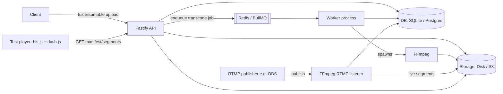

# CLAUDE.md

**Working name:** Chitrayaan

## What this is

A video ingestion, transcoding, and adaptive-bitrate streaming backend — a scoped-down version of
what Netflix/YouTube/Brightcove do. Two halves:

1. **VOD (primary, build this first, fully-featured):** upload a file → transcode to an ABR ladder →
   package as HLS + DASH → serve for playback.
2. **Live (secondary, deliberately reduced scope):** accept a single RTMP stream → transcode one
   quality rung in real time → serve as a live HLS playlist.

## How to read this file

Every item under **"Locked-in decisions"** was an explicit choice made by the project owner across a
design conversation — treat these as fixed unless they say otherwise. Sections after that
(architecture, folder layout, milestone order, specific bitrates, library choices) are reasonable
engineering defaults filled in to make this buildable — flagged inline as `[default, adjustable]`.
If you (Fable) hit a decision point not covered by the locked-in list and not clearly a
`[default, adjustable]` item, **stop and ask** rather than assuming.

**Self-check:** re-read this file in full and confirm your working understanding still matches it —
after any context compaction, and at the start of each milestone check-in (decision #16). If
anything has drifted, say so before continuing rather than proceeding on a stale understanding.

---

## Locked-in decisions

| # | Decision | Choice | Why |
|---|---|---|---|
| 1 | Scope | VOD + live RTMP ingest | — |
| 2 | Build priority | VOD fully-featured first; live is a reduced secondary phase (single stream, single quality rung) | Protects the budget — live ingest is the higher-risk half |
| 3 | Language/runtime | Node.js + TypeScript | Orchestration-heavy workload (FFmpeg does the real work); async I/O suits many concurrent RTMP/FFmpeg processes; static types catch bugs in a pipeline with many async handoffs |
| 4 | Web framework | Fastify (reconsidered against Express and NestJS, confirmed) | TS-native, built-in schema validation for the config-driven feature endpoints, less ceremony than NestJS for a project this size, better default typing/validation than Express without extra libraries |
| 5 | Job queue | BullMQ + Redis | Mature, well-documented, handles VOD transcode job lifecycle (retries, progress, status) |
| 6 | Storage | Dual-mode, selectable via env: local disk **or** S3-compatible object storage | Owner wants both, switchable, not a forced either/or |
| 7 | Metadata DB | Dual-mode, paired with storage: SQLite for local mode, Postgres for cloud/S3 mode | Standard real-world pairing (file-based ↔ local, client-server ↔ cloud) |
| 8 | Live ingest mechanism | FFmpeg's own RTMP listener (`-f flv -listen 1 rtmp://...`) | Leans on a dependency already used everywhere else in the project; explicitly **not** hand-rolling the RTMP protocol (handshake/chunk streams/AMF0) — that was considered and rejected as out of budget scope |
| 9 | Streaming packaging | CMAF: encode once per rendition into fragmented MP4 segments, generate **both** HLS (`.m3u8`) and DASH (`.mpd`) manifests from the same segments | No duplicate encoding cost; this is how real systems actually do "both formats" |
| 10 | Codec ladder | H.264/AAC always on (default); AV1 available as an opt-in additional rendition | AV1 is slower to encode (real wall-clock cost, not Fable token cost) so it's opt-in, not default |
| 11 | H.265/HEVC | **Permanently excluded — not a v1 scoping call, do not revisit without an explicit new decision from the owner** | Fragmented patent licensing, and no native decode in Chrome/Firefox — would break local dev testing via hls.js, which only feeds segments to the browser's own decoder. |
| 12 | Auth | Single shared API key, checked via request header | Simplest thing that isn't "no auth at all" |
| 13 | v1 feature set | Thumbnail/scrubbing preview sprites, WebVTT subtitle support, watermark overlay — **all three included**, each independently toggleable via config, **off by default** | Owner wants all three, but opt-in per deployment |
| 14 | VOD upload method | Resumable/chunked upload via the **tus** protocol | Reliable for large files, worth the extra build complexity |
| 15 | Testing approach | Both: synthetic FFmpeg-generated clips (fast, free, no copyright issues) **and** real sample files the owner provides | Synthetic clips for fast iteration, real files to catch what synthetic clips can't |
| 16 | Check-in cadence | **Stop and report after every milestone.** Do not proceed to the next milestone without explicit go-ahead, even if the path forward seems obvious. | Owner wants tight control given the budget |
| 17 | Dev environment | Plain local processes first; containerize (Docker Compose) once the core VOD pipeline works | Avoids Docker overhead while the pipeline is still taking shape |
| 18 | Communication style | Every message to the owner must be concise *and* clear — not so terse that meaning is lost, not so verbose that budget gets burned restating things | Balances misinterpretation risk against token cost |
| 19 | Version control | Fable never takes a Git action that changes state (init, add, commit, push, branch, merge, tag, etc.) on its own. Read-only commands (status, fetch, pull, log, diff) are fine to run freely. For anything else: stop, ping the owner with a short reason and the exact command(s) to run, and wait. | Owner wants to stay in control of what enters version control and when |
| 20 | Stop/resume protocol | See "Working with the project owner" below | Owner needs to pause a long-running session cleanly and resume without losing or misreading state |

## Explicitly out of scope (non-goals)

Do not build these unless the owner explicitly asks:
- DRM / content protection of any kind
- H.265/HEVC, permanently (see #11 above — not just deferred)
- Hand-rolled RTMP protocol implementation (see #8 above)
- Full user-account system (signup/login/roles) — auth is a single shared API key
- CDN/edge distribution, multi-region anything
- Live DVR/rewind, or more than one concurrent live stream
- Automatic captioning/transcription (subtitles are manually uploaded WebVTT only)
- Horizontal scaling beyond what BullMQ gives for free with multiple worker processes

---

## Architecture `[default, adjustable]`



All endpoints except `/healthz` require an `X-API-Key` header matching the configured `API_KEY`.

## Repo layout `[default, adjustable]`

```
/src
  /api            Fastify app, routes, auth middleware
  /worker         BullMQ worker entrypoint, transcode job processor
  /lib
    /storage      Storage interface + local-disk and S3 drivers
    /db           DB interface + SQLite and Postgres drivers
    /transcode    FFmpeg wrapper, ABR ladder logic, codec profiles
    /packaging    CMAF segmenting + HLS/DASH manifest generation
    /rtmp         FFmpeg RTMP listener lifecycle management (phase 2)
    /features
      /thumbnails
      /subtitles
      /watermark
  /config         Env var loading + validation
/test
  /fixtures       Script-generated synthetic clips (generated at test-run time, not committed as binaries)
  /samples        Gitignored — put your own real sample clips here locally
  /unit
  /integration
/player           Static test page: hls.js + dash.js, plain HTML
docker-compose.yml   (added at the containerize milestone, not before)
.env.example
CLAUDE.md
```

## Environment variables `[default, adjustable — but the modes themselves are locked decisions]`

| Variable | Values | Notes |
|---|---|---|
| `PORT` | e.g. `3000` | API server port |
| `API_KEY` | shared secret string | Required on every non-health endpoint |
| `STORAGE_BACKEND` | `local` \| `s3` | |
| `LOCAL_STORAGE_PATH` | path | Used when `STORAGE_BACKEND=local` |
| `S3_ENDPOINT`, `S3_BUCKET`, `S3_ACCESS_KEY`, `S3_SECRET_KEY`, `S3_REGION` | — | Used when `STORAGE_BACKEND=s3` (MinIO locally) |
| `DB_BACKEND` | `sqlite` \| `postgres` | |
| `SQLITE_PATH` | path | Used when `DB_BACKEND=sqlite` |
| `DATABASE_URL` | connection string | Used when `DB_BACKEND=postgres` |
| `REDIS_URL` | connection string | For BullMQ |
| `PACKAGE_FORMATS` | comma list, default `hls,dash` | Which manifest types to generate |
| `CODEC_LADDER` | comma list, default `h264` | Add `,av1` to opt in |
| `FEATURE_THUMBNAILS` | `true`/`false`, default `false` | |
| `FEATURE_SUBTITLES` | `true`/`false`, default `false` | |
| `FEATURE_WATERMARK` | `true`/`false`, default `false` | |
| `WATERMARK_IMAGE_PATH`, `WATERMARK_POSITION`, `WATERMARK_OPACITY` | — | Used when watermark feature is on |
| `TUS_UPLOAD_MAX_SIZE_MB` | int | Upload size cap |
| `RTMP_LISTEN_PORT` | e.g. `1935` | Phase 2 |
| `RTMP_STREAM_KEY` | shared secret string | Phase 2 — single-stream MVP, one key |
| `TEST_SAMPLES_DIR` | path, default `./test/samples` | Where your real sample clips live |

## ABR ladder defaults `[default, adjustable]`

Starting rung set (H.264/AAC baseline — same rungs get an AV1 variant when that codec is opted in):

| Rendition | Resolution | Video bitrate | Audio |
|---|---|---|---|
| Low | 360p | ~800 kbps | AAC-LC 128kbps, 48kHz stereo |
| Mid | 480p | ~1400 kbps | same |
| High | 720p | ~2800 kbps | same |
| Top | 1080p | ~5000 kbps | same |

## API surface `[default, adjustable]`

- `POST /api/uploads`, `PATCH /api/uploads/:id`, `HEAD /api/uploads/:id` — tus upload protocol
- `GET /api/jobs/:id` — transcode job status
- `GET /api/jobs` — list jobs (paginated)
- `GET /api/videos/:id/master.m3u8` — HLS master playlist
- `GET /api/videos/:id/master.mpd` — DASH manifest
- `GET /api/videos/:id/...` — segment/rendition files
- `POST /api/live/streams` / `DELETE /api/live/streams/:id` / `GET /api/live/streams/:id` — phase 2, lifecycle
- `GET /api/live/:id/live.m3u8` — phase 2, live playlist
- `GET /healthz` — no auth required

## Testing strategy

- **Synthetic fixtures:** a script generates short (5–15 second) deterministic test clips using
  FFmpeg's `testsrc`/`sine` filters, plus deliberately broken fixtures (truncated file, zero-duration,
  wrong-extension non-video file, oversized file) to exercise error handling. Generated at test-run
  time, not committed as binaries.
- **Real samples:** drop your own short clips in `test/samples/` (gitignored, path configurable via
  `TEST_SAMPLES_DIR`) for milestone-completion validation — not for every iteration, since real
  full-length files are slower to encode and unnecessary for fast inner-loop testing.
- Suggested test runner: **Vitest** `[default, adjustable]`.
- Every milestone below should end with the test suite green before reporting back.

## Build plan & milestones

**Standing rule: stop after each milestone, summarize what was built and how it was verified, and
wait for explicit go-ahead before starting the next one.** Do not batch milestones together.

### Phase 1 — VOD (build and validate against local storage/SQLite first, add cloud drivers later)

1. **Scaffolding** — repo structure, TypeScript + lint/format config, env var schema/validation, `/healthz`.
2. **Storage + DB abstraction (local drivers only)** — disk storage driver, SQLite driver, behind shared interfaces.
3. **Resumable upload + auth** — tus upload endpoint, `X-API-Key` middleware, upload creates a job record.
4. **Job queue wiring** — BullMQ + Redis, worker process skeleton, job status API.
5. **First real transcode (vertical slice)** — single rendition (720p H.264/AAC) end-to-end, proves the whole pipe.
6. **Full ABR ladder + CMAF packaging** — all H.264 rungs, HLS + DASH manifests from shared segments.
7. **Test player** — static page with hls.js + dash.js to manually confirm playback.
8. **AV1 opt-in rendition** — behind `CODEC_LADDER`, verify it plays.
9. **Optional features** — thumbnails/sprites, subtitles, watermark, each behind its own flag, off by default.
10. **Hardening** — retries, corrupt/oversized file handling, full synthetic + real-sample test pass.
11. **Cloud drivers** — S3-compatible storage + Postgres, verified at parity with local mode via the same tests.
12. **Containerize** — `docker-compose.yml` wiring Redis, chosen DB, MinIO, API, and worker together.

### Phase 2 — Live ingest (reduced scope, secondary)

13. **FFmpeg RTMP listener** — accept a single incoming stream on `RTMP_LISTEN_PORT`.
14. **Live transcode + rolling HLS** — one quality rung, real-time, sliding-window live playlist.
15. **Live session lifecycle** — start/stop/status API, segment cleanup after the stream ends.

## Working with the project owner

### Communication style
Keep every message concise and clear — precise enough that nothing gets misread, short enough that it
doesn't burn budget restating things. When in doubt, favor "clear then short," not "short then clear."

### Version control
Fable does not take any Git action that changes state — `init`, `add`, `commit`, `push`, `branch`,
`merge`, `checkout -b`, `tag`, or similar — on its own initiative. Read-only commands (`git status`,
`git fetch`, `git pull`, `git log`, `git diff`, etc.) are fine to run freely at any time.

For anything else — repo creation/init, staging and committing, pushing to a remote, branching, or
any other action that changes repo state — stop and ping the owner with:
- A short reason the action is needed now
- The exact command(s) to run

Wait for the owner to confirm it's done before continuing anything that depends on it.

### Stop / resume protocol
The owner may need to pause at any point during a long-running session — this is independent of, and
can happen mid-task inside, the milestone check-in cadence in decision #16.

- On seeing the literal string **`[STOPNOW]`**: immediately finish only the smallest atomic unit of
  work currently in flight (the specific task or background operation actually running — *not* the
  rest of the current milestone). Don't start anything new. Save all work, then write a checkpoint
  file at the project root (e.g. `.fable-checkpoint.md`) recording: which milestone/task was in
  progress, exactly what's done vs. still pending, and whatever's needed to resume cleanly (open
  questions, intentionally-uncommitted work, the concrete next step). Confirm the checkpoint is
  written and it's safe to stop, then stop all work immediately.
- On seeing **`continue`** (case-insensitive) or the literal string **`[STARTNOW]`**: read the
  checkpoint file and resume exactly where it left off.
- Before resuming, verify nothing has changed since the checkpoint was written (file contents,
  dependency versions, environment, git state, etc.). If anything differs from what the checkpoint
  expects, stop immediately and report the discrepancy rather than guessing at what changed or
  trying to reconcile it automatically.

## Working style / budget hygiene

- Keep iteration-time test clips to 5–15 seconds. Save full-length or real sample files for
  milestone-completion checks only.
- Don't paste full FFmpeg stderr into context on every debug loop — tail or summarize it.
- FFmpeg encode time is wall-clock/compute cost on your own machine, not part of the token budget —
  don't let that distinction cause you to over- or under-invest in encode-side complexity.
- If a milestone is trending much larger than expected, say so before continuing rather than
  discovering it at the end.
